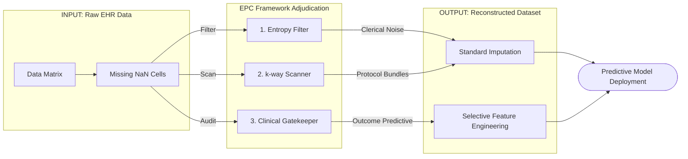

# Empirical Phenotype Classification (EPC) Framework

The Empirical Phenotype Classification (EPC) framework is a predictive-model-agnostic preprocessing pipeline that categorizes missing data mechanisms in Electronic Health Record (EHR) datasets prior to imputation. It classifies missing data into prognostic vectors, protocol blocks, and clerical noise to prevent predictive models from overfitting to administrative workflows or losing true clinical signals.

## Overview
EPC translates clinical deductive reasoning into sequential statistical checks, classifying missingness into three distinct categories:
* **Random Non-Informative Missingness:** Filtered using a dynamic noise floor derived from Symmetric Uncertainty (SU) permutation testing. Resolved via simple median or mode substitution.
* **Outcome-Predictive Missingness:** Identified via a formal diagnostic audit requiring intersectional satisfaction of Information Value (IV > 0.05), Fisher's Exact Test with FDR correction (q < 0.05), and Positive Likelihood Ratio (LR+ > 1.5 or < 0.67). Retained as a binary predictive feature while the underlying continuous variable is neutrally underlaid.
* **Structurally Bundled Missingness:** Mapped using a $k$-way structural scanner (Interaction Information Gain) to preserve routine clinical protocols. Reconstructed using joint multivariate imputation (e.g., MICE) to maintain clinical covariance.

## Dependencies
* Python >= 3.10
* scikit-learn >= 1.3
* xgboost >= 2.0
* pandas
* numpy
* scipy

## Repository Structure
* `data/`: Scripts for generating the synthetic cohort and extracting the MIMIC-IV (v2.2) retrospective cohort.
* `epc_framework/`: Core modules for the SU permutation filter, the clinical criteria gatekeeper (IV, Fisher's, LR+), and the $k$-way structural scanner.
* `evaluation/`: Scripts for executing the dual-classifier evaluation (XGBoost and Logistic Regression) and calculating bootstrapped AUC and Sensitivity metrics.

## Installation

Clone the repository and install the required dependencies:

```bash
git clone [https://github.com/dzikos/epc-framework.git](https://github.com/dzikos/epc-framework.git)
cd epc-framework
pip install -r requirements.txt



